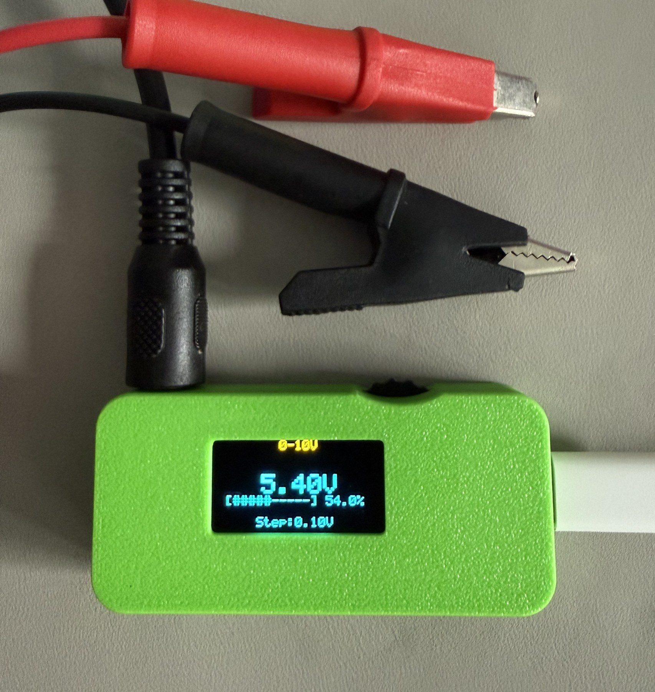
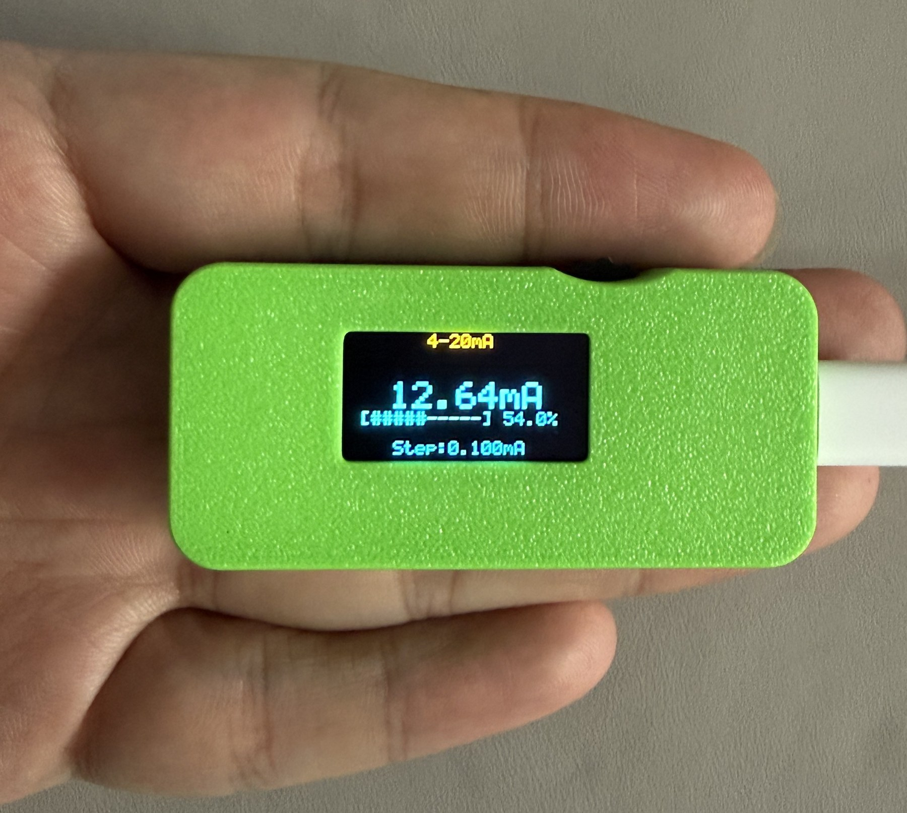
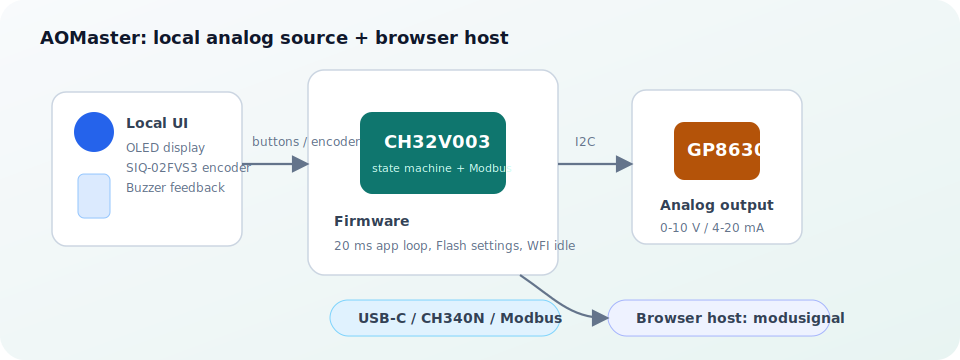
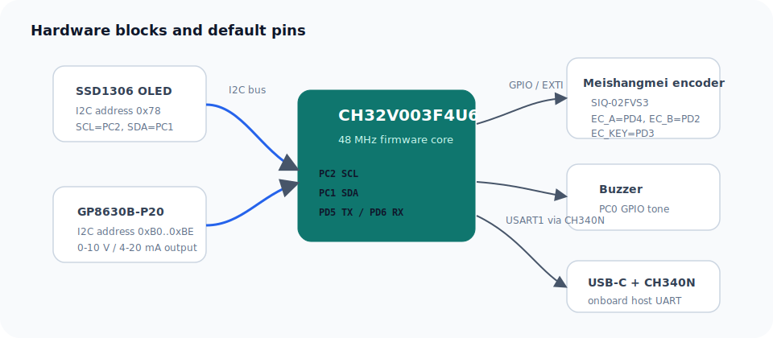
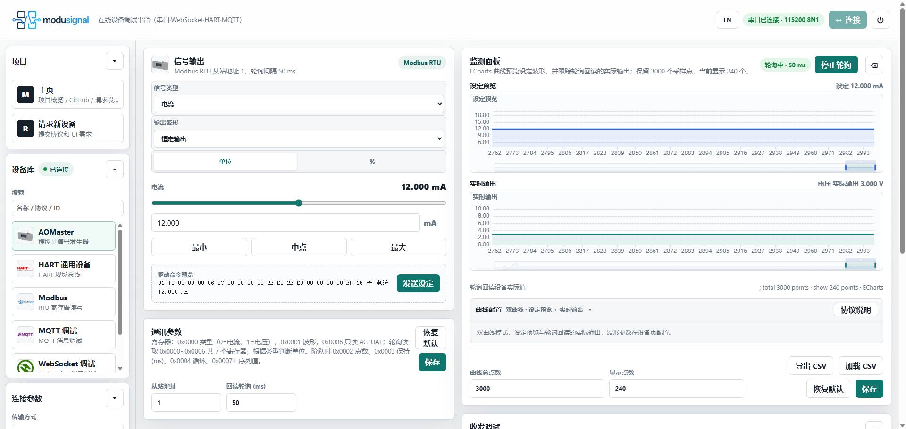
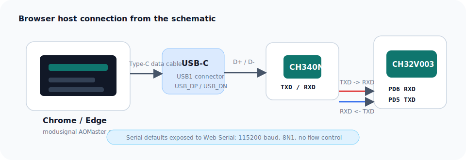
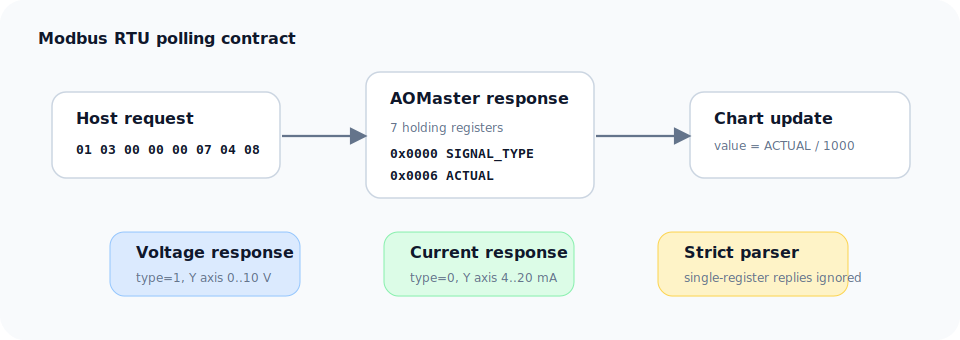

<div align="center">
  <h1>AOMaster</h1>
  <p><a href="./README.md">中文</a> | <strong>English</strong></p>
  <p>
    A portable analog-output controller based on <strong>CH32V003F4U6 + GP8630</strong>, with OLED local control, 0-10 V / 4-20 mA output, waveform generation, Flash persistence, and a USART1 Modbus RTU browser host.
  </p>
</div>

## Project Links

- OSHWHub: [https://oshwhub.com/txp666/project_dvokplei](https://oshwhub.com/txp666/project_dvokplei)
- Browser host: [https://modusignal.cn/](https://modusignal.cn/)

## Product Photos

<table>
  <tr>
    <td align="center" width="50%">
      <br>
      <sub>Bench output wiring</sub>
    </td>
    <td align="center" width="50%">
      <br>
      <sub>Handheld size</sub>
    </td>
  </tr>
</table>

## Quick Usage

1. Power AOMaster with a Type-C data cable and wait until the OLED shows `AOMaster OK`.
2. Connect the output terminals to the device or instrument input under test. Use voltage mode for 0-10 V inputs and current mode for 4-20 mA inputs.
3. Short-press the encoder to change the step size and rotate it to adjust the output; long-press to enter the menu, choose `0-10V Volt` or `4-20mA Cur`, then short-press to save.
4. For browser control, open [modusignal](https://modusignal.cn/) in Chrome or Edge, select **AOMaster** and **Serial**, and keep the serial settings at `115200 8N1`.
5. Set the output mode, waveform, and values in the host page, then start polling and confirm that the setpoint and actual-output charts match.
6. Before disconnecting the load or changing wiring, return the output to a safe value to avoid applying the wrong voltage or current to the target.

<p align="center">
  
</p>

## Features

| Feature | Description |
| --- | --- |
| Analog output | 0-10 V voltage output and 4-20 mA current output through GP8630 |
| Local control | OLED readout, Meishangmei `SIQ-02FVS3` encoder, short press for step size, long press for menu |
| Waveforms | Constant, step, ramp, square, triangle, sine; step sequence supports up to 16 points |
| Persistence | Output mode and percentage are saved to Flash and restored on boot |
| Browser host | USART1 / Modbus RTU, default `115200 8N1`, slave id `0x01`, write settings and poll readback |
| Idle power saving | Main loop enters WFI when idle and wakes from timer, encoder, or UART interrupt |

## Hardware

| Module | Pins / Bus | Notes |
| --- | --- | --- |
| MCU | CH32V003F4U6 | RISC-V core, 48 MHz system clock |
| OLED | PC2=SCL, PC1=SDA | SSD1306, 8-bit write address `0x78` |
| GP8630 | Shared OLED I2C bus | 8-bit write address `0xB0..0xBE`, selected by A0/A1/A2 |
| Encoder | Meishangmei `SIQ-02FVS3`, PD4=EC_A, PD2=EC_B, PD3=EC_KEY | A/B/KEY have 10 kΩ pull-ups to VCC; EH is tied to GND |
| Buzzer | PC0 | Short feedback tones for rotation/key events |
| USB / host | USB-C + CH340N, CH340N TXD/RXD to MCU RXD/TXD | USART1, 115200 8N1, Modbus RTU |
| Programming | WCH-Link | Use the MounRiver Studio project |

<p align="center">
  
</p>

## Browser Host Connection

The recommended host is the AOMaster page in [modusignal](https://modusignal.cn/), or a local static copy of the same web app.

1. Connect the PC directly to the onboard USB-C port with a Type-C data cable. The onboard CH340N enumerates as a serial port.
2. Open the host page in Chrome or Edge. Web Serial requires HTTPS or `localhost`.
3. Select **AOMaster** and choose **Serial** transport.
4. Keep the default serial settings: `115200` baud, `8N1`, no flow control.
5. Connect, send output settings, start/stop polling, and inspect the setpoint preview and actual-output charts.

<p align="center">
  
  <br>
  <sub>modusignal host: serial connection, output settings, polling readback, and chart monitoring</sub>
</p>

<p align="center">
  
</p>

### Host Polling Protocol

The host uses Modbus RTU function code `0x03` to read holding registers `0x0000..0x0006` in one request. This response contains both the output type and actual output, so the frontend can decide whether the value is current or voltage.

Recommended polling request:

```text
01 03 00 00 00 07 04 08
```

Parsing rules:

| Field | Meaning |
| --- | --- |
| `0x0000 SIGNAL_TYPE` | `0=current`, `1=voltage` |
| `0x0006 ACTUAL` | Current actual output, read-only |
| Raw scaling | `raw / 1000`; for example `10600` means `10.600 V` or `10.600 mA` |
| Actual chart Y axis | Voltage responses use `0..10 V`; current responses use `4..20 mA` |

<p align="center">
  
</p>

## Register Map

| Address | R/W | Name | Meaning | Raw unit |
| --- | --- | --- | --- | --- |
| `0x0000` | R/W | `SIGNAL_TYPE` | `0=current`, `1=voltage` | enum |
| `0x0001` | R/W | `WAVEFORM` | `0=constant`, `1=step`, `2=ramp`, `3=square`, `4=triangle`, `5=sine` | enum |
| `0x0002` | R/W | `VALUE_A` | Setpoint / low value; step mode count | mV or uA |
| `0x0003` | R/W | `VALUE_B` | High value; step mode dwell | mV/uA or ms |
| `0x0004` | R/W | `PERIOD_MS` | Period; step mode loop count | ms / count |
| `0x0005` | R/W | `DUTY` | Square-wave duty cycle | permille |
| `0x0006` | R | `ACTUAL` | Actual output readback, read-only | mV or uA |
| `0x0007..0x0016` | R/W | `STEP_SEQUENCE` | Step sequence values, max 16 points | mV or uA |

Write constraints:

- `ACTUAL` is read-only. Any write request containing `0x0006` is rejected.
- In step mode, write `0x0007+` sequence values first, then write header registers `0x0000..0x0005`.
- CRC is standard Modbus RTU CRC16, polynomial `0xA001`, low byte first.

## Local Operation

After boot, the device initializes the OLED and GP8630, then restores the last saved output mode and value.

| Action | Result |
| --- | --- |
| Rotate encoder | Increase/decrease output |
| Short press | Change step size |
| Long press | Enter menu |

Voltage mode uses `0-10 V` as the 0-100% baseline and allows extension to `0-12 V`. Current mode uses `4-20 mA` as the 0-100% baseline and allows extension to `0-24 mA`.

Menu:

```text
-- MENU --
> Output Mode
  Signal Gen
  Calibrate
  Brightness
  Status
  Exit
```

The operation hints at the bottom of the OLED mean:

| Hint | Encoder action | Meaning |
| --- | --- | --- |
| `Turn` | Rotate | Move the menu cursor, or increase/decrease the current value while editing |
| `OK` | Short press | Enter the selected item, confirm the current step, or save the current setting |
| `L` | Long press | Go back one level; from the home screen it enters the menu, and from the main menu it returns home |

Main menu items:

| Item | Purpose | Operation signals |
| --- | --- | --- |
| `Output Mode` | Select normal output mode: `0-10V Volt` or `4-20mA Cur` | `Turn` to select, `OK` to save and reinitialize GP8630, `L` to return |
| `Signal Gen` | Local signal generator for output type, waveform, low value, high value, and period | `OK` to enter/finish editing, `Turn` to adjust, `L` to return |
| `Calibrate` | Start 0/10 V or 4/20 mA two-point calibration | `Turn` to adjust the DAC code, `OK` for next/save, `L` for previous/back |
| `Brightness` | Adjust OLED brightness | `Turn` to change brightness, `OK` to save, `L` to cancel and restore the previous brightness |
| `Status` | Show GP8630 status, I2C address, and I2C error count | `OK` or `L` returns to the main menu |
| `Exit` | Leave the menu and return to the home screen | `OK` returns home |

`Signal Gen` fields:

| Field | Meaning | Edit behavior |
| --- | --- | --- |
| `Run` | Start or stop local signal output | Select it and short-press `OK` to toggle `ON/OFF` |
| `Type` | Output type, `4-20mA` or `0-10V` | Rotate while editing to switch |
| `Wave` | Local waveform: `RAMP`, `SQR`, `TRI`, or `SINE` | Rotate while editing to switch |
| `Low` | Waveform low value | Rotate while editing; step is about `0.10 V` or `0.10 mA` |
| `High` | Waveform high value | Rotate while editing; step is about `0.10 V` or `0.10 mA` |
| `Per` | Period, range `100..60000 ms` | Rotate while editing; step is `100 ms` |

Note: the local `Signal Gen` menu is intended for quick continuous waveform generation; the register protocol still supports the full `constant`, `step`, `ramp`, `square`, `triangle`, and `sine` configuration.

## Software Layout

```text
User/
├── main.c                 # Entry point
├── ch32v00x_it.c          # ISR entry points: USART / encoder / etc.
├── system_ch32v00x.c      # Chip clock initialization
├── Sys/                   # System layer: tick, scheduler, logging, power
├── Bsp/                   # Board support: I2C, encoder, buzzer
├── Drv/                   # Device drivers: SSD1306, GP8630
└── App/                   # Application: state machine, UI, settings, Modbus
```

Core loop:

```text
main
  -> System_Init()
  -> App_Begin()
  -> while(1)
       System_Update()
       App_Update()
       App_SerialPoll()
       Power_Idle()
```

## Build and Flash

1. Open `AOMaster.wvproj` with **MounRiver Studio**.
2. Build to generate `obj/AOMaster.hex`.
3. Flash with WCH-Link.

If the MRS project or Makefile is regenerated, make sure all `.c` files under `User/` subdirectories are included.

## Debug Log

`AOMASTER_LOG_ENABLE` defaults to `0` so log bytes do not mix into Modbus RTU responses. To enable UART logs, edit `User/Sys/log.h`:

```c
#define AOMASTER_LOG_ENABLE 1
```

Typical log output:

```text
AOMaster boot clk=48000000
settings load mode=1 permille=500
app begin permille=500 mode=1
hb app=RUN gp=OK addr=0xB0 i2c=1 err=0
```

## License

This repository is released under the [PolyForm Noncommercial License 1.0.0](./LICENSE) for noncommercial use only. The license scope covers the entire AOMaster product materials, including firmware, software, documentation, images, hardware design files, and future open hardware materials.

Commercial use is not permitted without separate written permission, including but not limited to manufacturing for sale, resale, paid integration, or use in a commercial product or service. Contact the project author for commercial licensing.

Note: because commercial use is prohibited, this project is not open source under the OSI definition and is not open hardware under the OSHWA definition. In this repository, "open hardware" means that hardware materials will be published for learning, research, and noncommercial reproduction.
