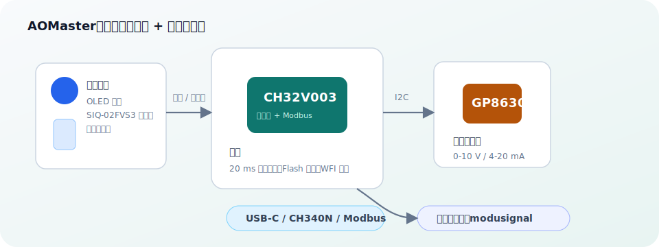
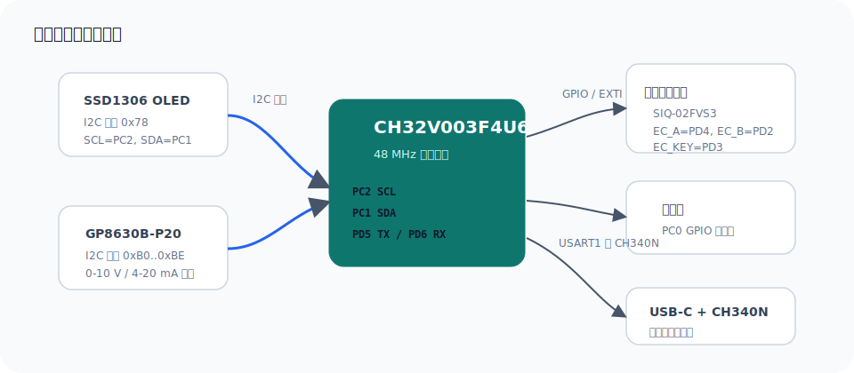
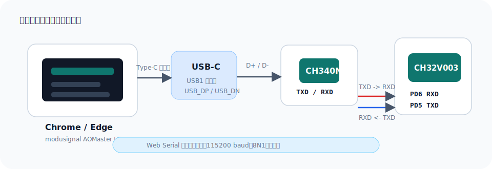
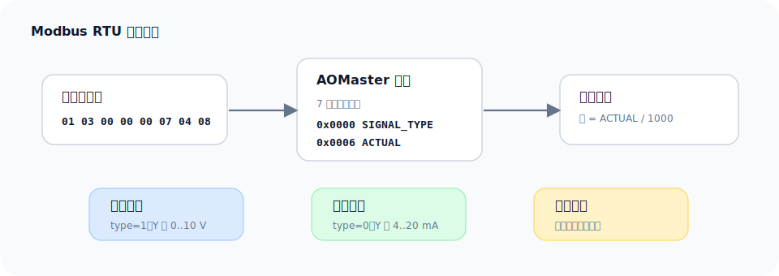

<div align="center">
  <h1>AOMaster</h1>
  <p><strong>中文</strong> | <a href="./README.en.md">English</a></p>
  <p>
    基于 <strong>CH32V003F4U6 + GP8630</strong> 的便携式模拟量输出控制器，支持 OLED 本地调节、0-10 V / 4-20 mA 输出、波形输出、Flash 参数保存和 USART1 Modbus RTU 网页上位机控制。
  </p>
</div>

## 项目链接

- 嘉立创开源：[https://oshwhub.com/txp666/aomaster](https://oshwhub.com/txp666/aomaster)
- 网页上位机：[https://modusignal.cn/](https://modusignal.cn/)

## 实物照片

<table>
  <tr>
    <td align="center" width="50%">
      <br>
      <sub>输出夹线测试</sub>
    </td>
    <td align="center" width="50%">
      <br>
      <sub>掌心尺寸</sub>
    </td>
  </tr>
</table>

## 使用说明

1. 使用 Type-C 数据线给 AOMaster 供电，等待 OLED 显示 `AOMaster OK`。
2. 将输出端接到待测设备或仪表输入端。电压模式接 0-10 V 输入，电流模式接 4-20 mA 输入。
3. 短按编码器切换步进档位，旋转编码器调整输出值；长按进入菜单，选择 `0-10V Volt` 或 `4-20mA Cur` 后短按保存。
4. 需要上位机控制时，在 Chrome / Edge 打开 [modusignal](https://modusignal.cn/)，选择 **AOMaster** 和 **Serial**，串口参数保持 `115200 8N1`。
5. 在上位机中设置输出模式、波形和值，启动轮询后确认设定曲线和实际输出曲线一致。
6. 断开负载或切换接线前，先把输出调回安全值，避免误加电压或电流到被测端。

<p align="center">
  
</p>

## 主要特性

| 功能 | 说明 |
| --- | --- |
| 模拟量输出 | 0-10 V 电压输出、4-20 mA 电流输出，内部使用 GP8630 DAC/模拟量输出芯片 |
| 本地控制 | OLED 显示当前模式/输出值，美上美 `SIQ-02FVS3` 编码器调节，短按切换步进，长按进入菜单 |
| 波形输出 | 支持恒定、阶跃、斜坡、方波、三角波、正弦波；阶跃序列最多 16 点 |
| 参数保存 | 输出模式和百分比写入 Flash，上电恢复上次状态 |
| 网页上位机 | USART1 / Modbus RTU，默认 115200 8N1、从站 `0x01`，支持写设定和 50 ms 轮询回读 |
| 低功耗空闲 | 主循环空闲时进入 WFI，由定时器、编码器或串口中断唤醒 |

## 硬件连接

| 模块 | 引脚/总线 | 说明 |
| --- | --- | --- |
| MCU | CH32V003F4U6 | RISC-V 内核，48 MHz 系统时钟 |
| OLED | PC2=SCL, PC1=SDA | SSD1306，8 位写地址 `0x78` |
| GP8630 | 与 OLED 共用 I2C | 8 位写地址 `0xB0..0xBE`，由 A0/A1/A2 决定 |
| 编码器 | 美上美 `SIQ-02FVS3`，PD4=EC_A, PD2=EC_B, PD3=EC_KEY | A/B/KEY 均 10 kΩ 上拉到 VCC，EH 接地 |
| 蜂鸣器 | PC0 | 旋转/按键短音反馈 |
| USB/上位机 | USB-C + CH340N，CH340N TXD/RXD 接 MCU RXD/TXD | USART1，115200 8N1，Modbus RTU |
| 下载调试 | WCH-Link | 使用 MounRiver Studio 工程配置烧录 |

<p align="center">
  
</p>

## 网页上位机连接

AOMaster 的上位机推荐使用 [modusignal](https://modusignal.cn/) 的 AOMaster 页面，也可以本地运行 `modusignal` 静态网页。连接方式如下：

1. 直接使用 Type-C 数据线连接电脑和 AOMaster 板载 USB 口，板上的 CH340N 会枚举为串口。
2. 在 Chrome / Edge 中打开上位机页面。Web Serial 需要 HTTPS 或 `localhost`。
3. 选择设备 **AOMaster**，传输方式选择 **Serial**。
4. 串口参数保持默认：`115200` baud、`8N1`、无流控。
5. 点击连接后，可发送输出设定、启动/停止轮询，并查看设定预览曲线和实际输出曲线。

<p align="center">
  
  <br>
  <sub>modusignal 上位机：串口连接、输出设定、轮询回读和曲线监测</sub>
</p>

<p align="center">
  
</p>

### 上位机轮询协议

上位机使用 Modbus RTU 功能码 `0x03` 一次读取 `0x0000..0x0006` 共 7 个保持寄存器。这样回包同时包含输出类型和实际输出值，前端可正确判断当前是电流还是电压。

推荐轮询请求：

```text
01 03 00 00 00 07 04 08
```

解析规则：

| 字段 | 说明 |
| --- | --- |
| `0x0000 SIGNAL_TYPE` | `0=电流`，`1=电压` |
| `0x0006 ACTUAL` | 当前实际输出，只读 |
| 原始值缩放 | `raw / 1000`，例如 `10600` 表示 `10.600 V` 或 `10.600 mA` |
| 实际曲线 Y 轴 | 电压回包使用 `0..10 V`，电流回包使用 `4..20 mA` |

<p align="center">
  
</p>

## 寄存器表

| 地址 | 读写 | 名称 | 含义 | 原始单位 |
| --- | --- | --- | --- | --- |
| `0x0000` | R/W | `SIGNAL_TYPE` | `0=current`，`1=voltage` | 枚举 |
| `0x0001` | R/W | `WAVEFORM` | `0=constant`，`1=step`，`2=ramp`，`3=square`，`4=triangle`，`5=sine` | 枚举 |
| `0x0002` | R/W | `VALUE_A` | 常量值/低值；阶跃模式为点数 | mV 或 uA |
| `0x0003` | R/W | `VALUE_B` | 高值；阶跃模式为单步保持时间 | mV/uA 或 ms |
| `0x0004` | R/W | `PERIOD_MS` | 周期；阶跃模式为循环次数 | ms / 次数 |
| `0x0005` | R/W | `DUTY` | 方波占空比 | 千分比 |
| `0x0006` | R | `ACTUAL` | 实际输出回读，只读 | mV 或 uA |
| `0x0007..0x0016` | R/W | `STEP_SEQUENCE` | 阶跃序列值，最多 16 点 | mV 或 uA |

写入约束：

- `ACTUAL` 只读，任何写入 `0x0006` 的请求会被拒绝。
- 阶跃模式需要先写 `0x0007+` 序列值，再写 `0x0000..0x0005` 头部寄存器，使新序列和新模式一次生效。
- CRC 使用标准 Modbus RTU CRC16，多项式 `0xA001`，低字节在前。

## 本地操作

### 主界面

设备上电后完成 OLED 和 GP8630 初始化，并恢复上次保存的模式和输出值。

| 操作 | 作用 |
| --- | --- |
| 旋转编码器 | 增减输出值 |
| 短按 | 切换步进档位 |
| 长按 | 进入菜单 |

电压模式按 `0-10 V` 作为 0-100% 基准，允许外推到 `0-12 V`；电流模式按 `4-20 mA` 作为 0-100% 基准，允许外推到 `0-24 mA`。

### 菜单

```text
-- MENU --
> Output Mode
  Signal Gen
  Calibrate
  Brightness
  Status
  Exit
```

屏幕底部的操作提示含义如下：

| 提示 | 编码器操作 | 含义 |
| --- | --- | --- |
| `Turn` | 旋转 | 移动菜单光标，或在编辑状态下增减当前值 |
| `OK` | 短按 | 进入当前菜单项、确认当前步骤或保存当前设置 |
| `L` | 长按 | 返回上一级；在主界面长按进入菜单，在主菜单长按返回主界面 |

主菜单项说明：

| 菜单项 | 作用 | 操作信号 |
| --- | --- | --- |
| `Output Mode` | 选择常规输出模式：`0-10V Volt` 或 `4-20mA Cur` | `Turn` 选择，`OK` 保存并重新初始化 GP8630，`L` 返回 |
| `Signal Gen` | 本地信号发生器，配置输出类型、波形、低值、高值和周期 | `OK` 进入/结束编辑，`Turn` 调整，`L` 返回 |
| `Calibrate` | 进入 0/10 V 或 4/20 mA 两点校准流程 | `Turn` 微调 DAC 码值，`OK` 下一步/保存，`L` 返回上一步 |
| `Brightness` | 调整 OLED 亮度 | `Turn` 调亮/调暗，`OK` 保存，`L` 放弃并恢复原亮度 |
| `Status` | 查看 GP8630 状态、I2C 地址和 I2C 错误计数 | `OK` 或 `L` 返回主菜单 |
| `Exit` | 退出菜单回到主界面 | `OK` 返回主界面 |

`Signal Gen` 菜单中的信号项：

| 项目 | 含义 | 编辑方式 |
| --- | --- | --- |
| `Run` | 启动或停止本地信号输出 | 选中后短按 `OK` 切换 `ON/OFF` |
| `Type` | 输出类型，`4-20mA` 或 `0-10V` | 进入编辑后旋转切换 |
| `Wave` | 本地波形，支持 `RAMP`、`SQR`、`TRI`、`SINE` | 进入编辑后旋转切换 |
| `Low` | 波形低值 | 进入编辑后旋转调整，步进约 `0.10 V` 或 `0.10 mA` |
| `High` | 波形高值 | 进入编辑后旋转调整，步进约 `0.10 V` 或 `0.10 mA` |
| `Per` | 周期，范围 `100..60000 ms` | 进入编辑后旋转调整，步进 `100 ms` |

说明：本地 `Signal Gen` 菜单用于快速生成连续波形；寄存器协议仍支持 `constant`、`step`、`ramp`、`square`、`triangle`、`sine` 的完整配置。

## 软件结构

```text
User/
├── main.c                 # 程序入口
├── ch32v00x_it.c          # 中断入口：USART / 编码器等
├── system_ch32v00x.c      # 芯片时钟初始化
├── Sys/                   # 系统层：时基、调度、日志、电源
├── Bsp/                   # 板级支持：I2C、编码器、蜂鸣器
├── Drv/                   # 芯片驱动：SSD1306、GP8630
└── App/                   # 应用层：状态机、UI、设置、Modbus
```

核心流程：

```text
main
  -> System_Init()
  -> App_Begin()
  -> while(1)
       System_Update()
       App_Update()
       App_SerialPoll()
       Power_Idle()
```

## 构建与烧录

1. 使用 **MounRiver Studio** 打开 `AOMaster.wvproj`。
2. 编译生成 `obj/AOMaster.hex`。
3. 通过 WCH-Link 下载。

注意：如果重新生成 MRS 工程或 Makefile，请确认 `User/` 下各子目录的 `.c` 文件均已加入构建。

## 调试日志

默认 `AOMASTER_LOG_ENABLE=0`，避免日志字节混入 Modbus RTU 回包。需要串口日志时，可在 `User/Sys/log.h` 中打开：

```c
#define AOMASTER_LOG_ENABLE 1
```

打开日志后的典型输出：

```text
AOMaster boot clk=48000000
settings load mode=1 permille=500
app begin permille=500 mode=1
hb app=RUN gp=OK addr=0xB0 i2c=1 err=0
```

## 许可证

本仓库采用 [PolyForm Noncommercial License 1.0.0](./LICENSE) 发布，仅允许非商业用途。许可范围覆盖整个 AOMaster 产品资料，包括固件、软件、文档、图片、硬件设计文件以及后续开源的硬件资料。

禁止未经书面授权的商业使用，包括但不限于量产销售、转售、付费集成、商业产品或商业服务中的使用。商业授权请联系项目作者。

说明：由于禁止商用，本项目不属于 OSI 定义的开源软件许可证，也不属于 OSHWA 定义的开放硬件许可证；这里的“开源硬件”指硬件资料会公开供学习、研究和非商业复现使用。
